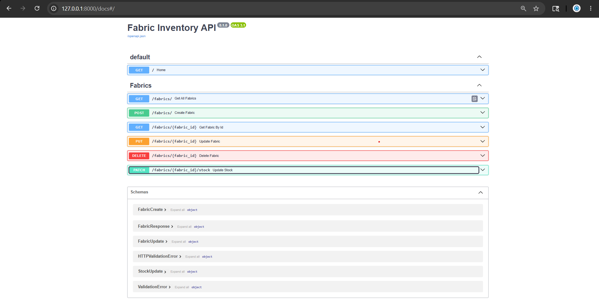
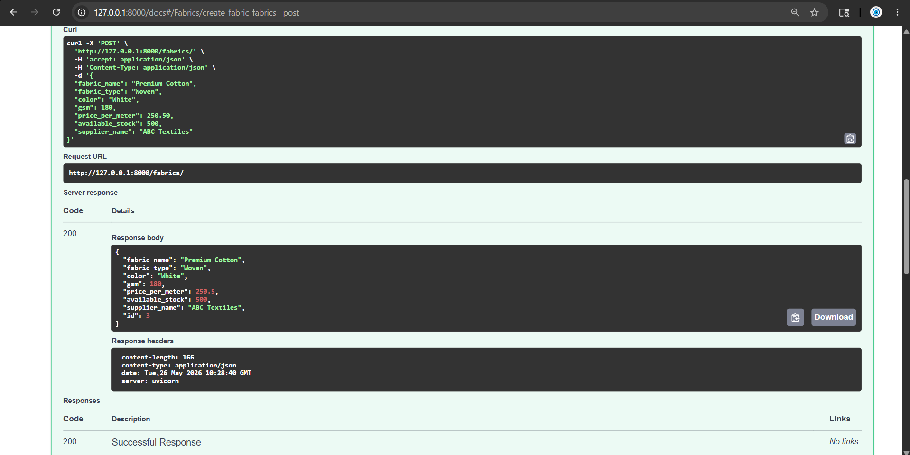
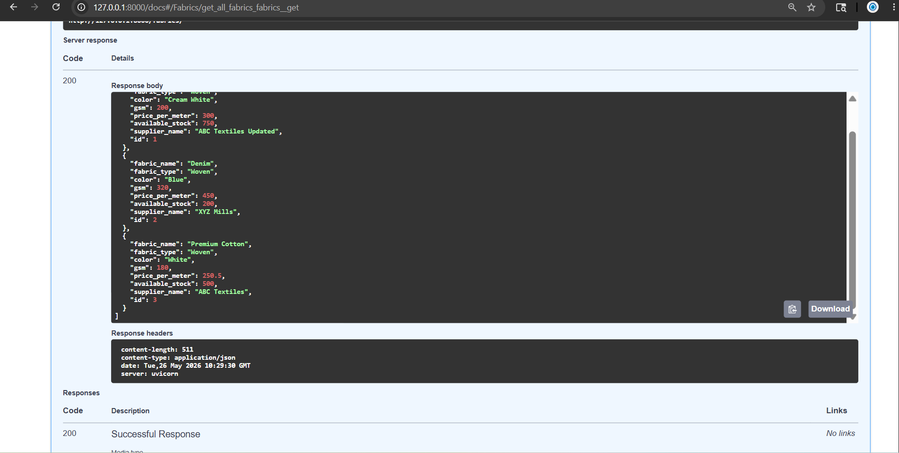
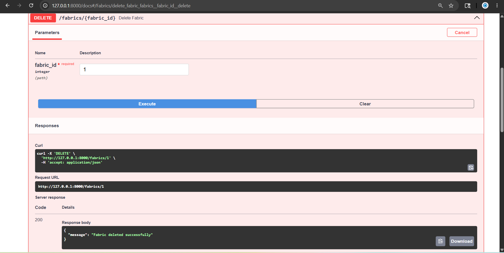
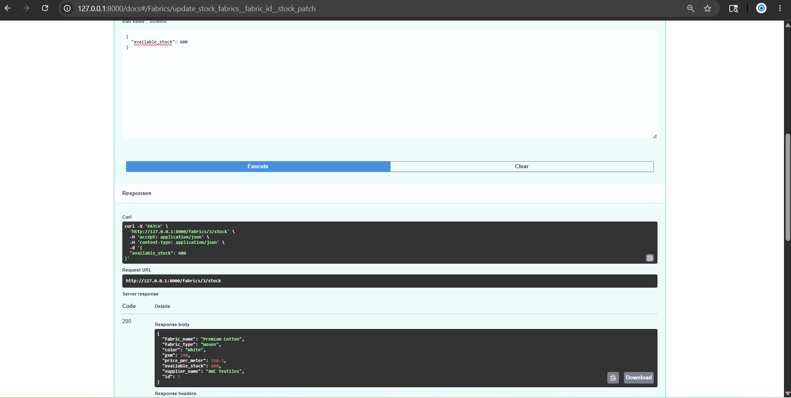

# Fabric Inventory FastAPI

A REST API built using FastAPI, SQLite, SQLAlchemy, and Pydantic to manage textile fabric inventory.

## Features

- Add Fabric Product
- Get All Fabric Products
- Get Fabric By ID
- Update Fabric Details
- Delete Fabric Product
- Update Fabric Stock
- Input Validation
- Exception Handling
- Interactive Swagger Documentation

## Tech Stack

- FastAPI
- SQLite
- SQLAlchemy ORM
- Pydantic
- Uvicorn

## Project Structure

```text
fabric_inventory/
│
├── app/
│   ├── main.py
│   ├── database.py
│   ├── models.py
│   ├── schemas.py
│   └── routers/
│       └── fabric.py
│
├── images/
├── README.md
├── requirements.txt
└── .gitignore
```

## API Endpoints

| Method | Endpoint | Description |
|----------|----------|----------|
| POST | /fabrics/ | Add Fabric |
| GET | /fabrics/ | Get All Fabrics |
| GET | /fabrics/{id} | Get Fabric By ID |
| PUT | /fabrics/{id} | Update Fabric |
| DELETE | /fabrics/{id} | Delete Fabric |
| PATCH | /fabrics/{id}/stock | Update Stock |

## Installation

Clone the repository:

```bash
git clone https://github.com/atmihaa-06/fabric-inventory-fastapi.git
```

Navigate to the project:

```bash
cd fabric_inventory
```

Install dependencies:

```bash
pip install -r requirements.txt
```

Run the server:

```bash
uvicorn app.main:app --reload
```

## Swagger Documentation

Open:

```text
http://127.0.0.1:8000/docs
```

---

## Screenshots

### Swagger UI



### Add Fabric Product



### Get All Fabrics



### Delete Fabric



### Update Stock



---

## Author

**Atmihaa MB**
